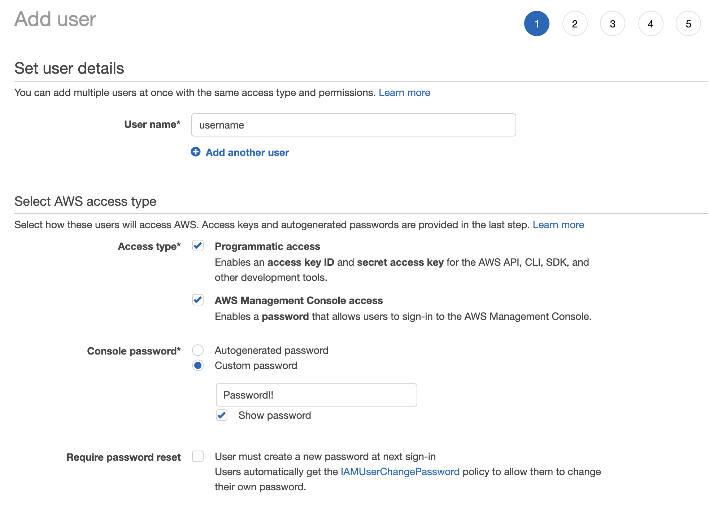
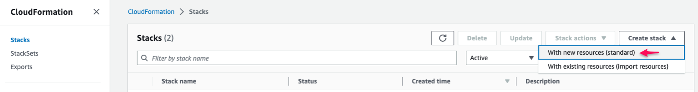
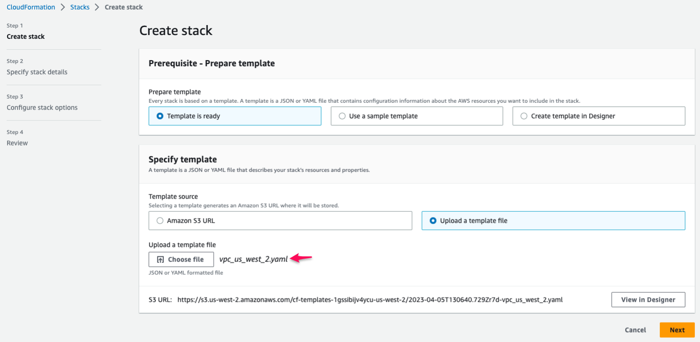
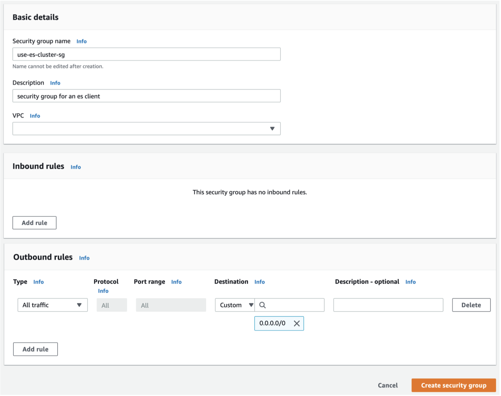
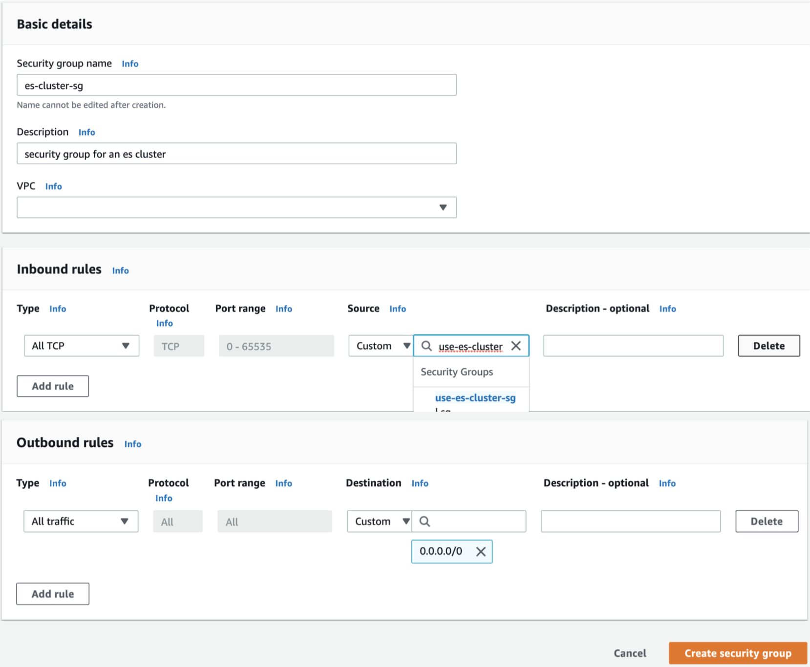
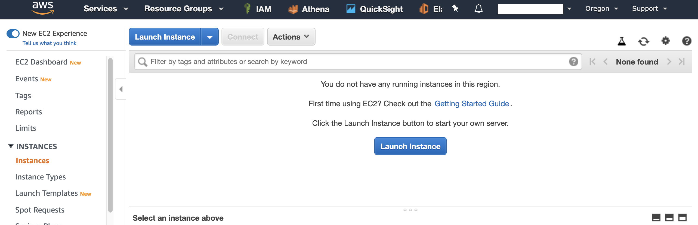
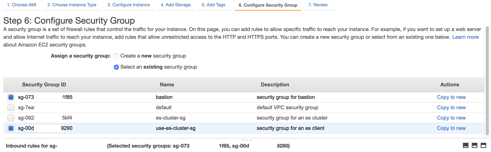
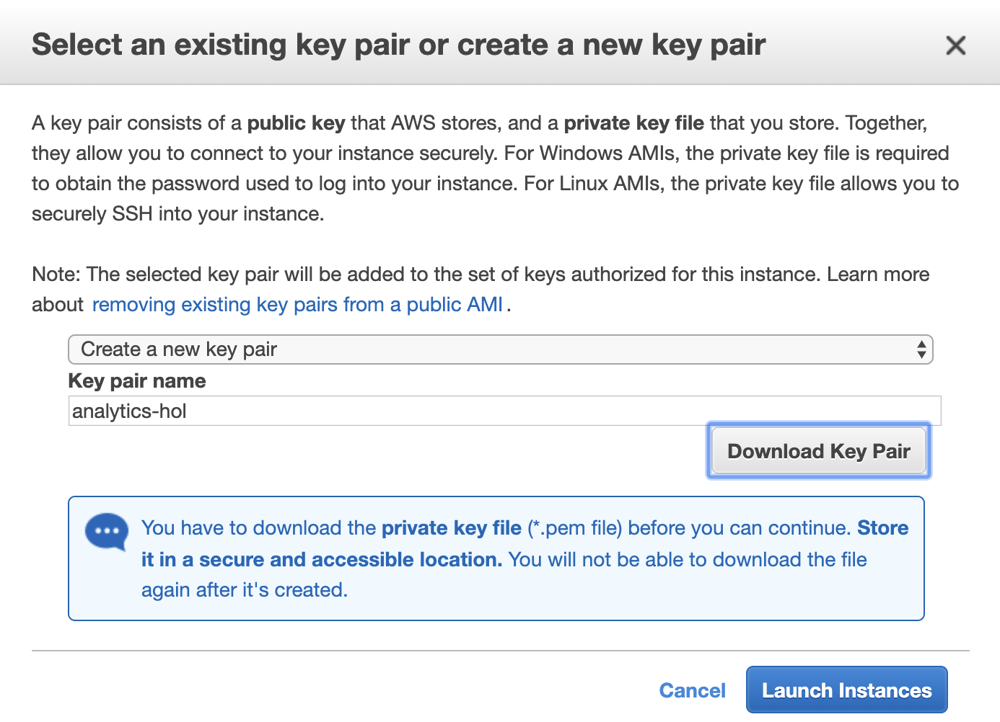
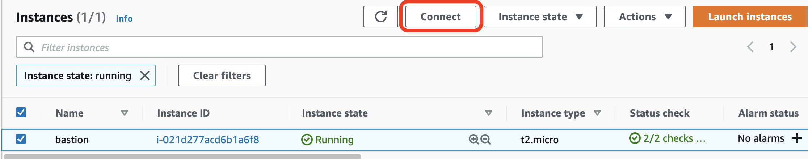

# <a name="top"></a>Lab setup
Before starting the lab, create and configure EC2, the IAM user you need.

## Table of Contents
* [Creating an IAM User](#iam-user)
* [Creating a new VPC](#vpc)
* [Creating Security Groups](#security-group)
* [Launch an EC2 Instance](#ec2-launch)
* [Configuring your EC2 Instance](#ec2-user-configuration)

## <a name="iam-user"></a>Creating an IAM User
Let’s create an IAM User to use during the lab.

1. Log in to the AWS Management Console and access the IAM service.
2. Select **Users** from the left menu.
3. Click the **Add user** button to enter the Add User page.
4. Enter `<user name>` in User name, and then choose both **Programmatic access** and **AWS Management Console access**. Next, enter `<password>` in **Console password**,
In last, uncheck **Require password reset**.
 
5. Click the **\[Next: Permissions\]** button, select **Attach existing policies directly**, and add **AdministratorAccess** privileges.
 
6. Click the **\[Next: Review\]** button, check the information, and click the **Create user** button.
7. Click the **Download.csv** button to download the new user's information. This file is essential for setting up EC2, so save it in a location that is easy to remember.
 

\[[Top](#top)\]

## <a name="vpc"></a>Creating a new VPC
Let’s create a new VPC to use during the lab.

1. Log in to the AWS Management Console and select CloudFormation from the list of services.
2. Select **Create stack** from the left menu.
3. Choose **With new resources (standard)** from the dropdown list.
   
4. In **Specify template** section, choose **Upload a template file**.
5. Click **Choose file** button, and upload a cloudformation template download from [https://github.com/aws-samples/aws-analytics-immersion-day](https://github.com/aws-samples/aws-analytics-immersion-day).
   
   ::alert[Make sure you choose a cloudformation template file corresponding to your region.]{type="info"}
6. Click **Next** button.
7. Enter Stack name (e.g., `vpc`), and Click **Next** button.
8. Click **Next** button to skip  `Step 3 Configure stack options`.
9.  Click **Submit** button.

\[[Top](#top)\]

## <a name="security-group"></a>Creating Security Groups
### Security Groups to create an EC2 instance for a bastion host
Create and configure a security group of EC2 instance.

1. Connect to the EC2 service in the AWS Management Console.
2. Select the **Security Groups** item from the **NETWORK & SECURITY** menu.
3. Click **\[Create Security Group\]**.
4. On the **Create Security Group** screen, enter the necessary information for the **Security Group**, and then **\[Create\]** a new security group.
    + Security group name : `bastion`
    + Description : `security group for bastion`
 
    Enter the following in **Inbound** of the security group rules.
    + Type : SSH
    + Protocol : TCP
    + Port Range : 22
    + Source : `0.0.0.0/0`

    

\[[Top](#top)\]

### Security Groups created for use in Elasticsearch Service
Create and configure a security group for Elasticsearch Service.

1. Connect to EC2 service in AWS Management Console.
2. Select the **Security Groups** item from the **NETWORK & SECURITY** menu.
3. Click **\[Create Security Group\]**.
4. On the **Create Security Group** screen, enter the necessary information for the Security Group, and then **\[Create\]** a new security group.
    + Security group name : `use-es-cluster-sg`
    + Description : `security group for an es client`

    Enter nothing in **Inbound** of the security group rules.

    
5.  Click **\[Create Security Group\]** again to go to the **Create Security Group** screen. After entering the necessary information for the security group, **\[Create\]** a new security group.
    + Security group name : `es-cluster-sg`
    + Description : `security group for an es cluster`
 
    Enter the following in **Inbound** of the security group rules.
    + Type : All TCP
    + Protocol : TCP
    + Port Range : 0-65535
    + Source : `use-es-cluster-sg` 의 security group id ex) sg-038b632ef1825cb7f

     

\[[Top](#top)\]

## <a name="ec2-launch"></a>Launch an EC2 Instance
Create an EC2 instance that will generate the data needed for the lab in real time.

1. Connect to EC2 service in AWS Management Console.
2. In the upper right, select your region (e.g., **N. Virginia**).
3. Select **Instances** from the left **INSTANCES** menu and click **\[Launch Instance\]** to start creating a new instance.
   
4. Step 1: On the **Choose an Amazon Machine Image (AMI)** screen, choose **Amazon Linux 2 AMI (HVM), SSD Volume Type**.
   
5. Step 2: On the **Choose an Instance Type** screen, select `t2.micro` as the instance type. Click **\[Next: Configure Instance Details\]**.
   
6. Step 3: On the **Configure Instance Details** screen, select **Enable** for **Auto-assign Public IP**, and click **\[Next: Add Storage\]**.
   
7. Step 4: On the **Add Storage** screen, leave the defaults and click **\[Next: Add Tags\]**.
8. Step 5: On the **Add Tags** screen, click **\[Next: Configure Security Group\]**.
9. Step 6: On the **Configure Security Group** screen, select **Select an existing security group** from **Assign a security group**, and then select `bastion` and `use-es-cluster-sg` from the **Security Group** and click **\[Review and Launch\]**.
    
10. Step 7: click **\[Launch\]** on the **Review Instance Launch** screen. 
11. Create a key pair to access EC2 Instance.
Select Create a new key pair, enter `analytics-hol` as the Key pair name, and click **Download Key Pair**.
Save the Key Pair to any location on your PC and click **\[Launch Instances\]**. (EC2 Instance startup may take several minutes.)
    
12. For MacOS users, Change the File Permission of the downloaded Key Pair file to 400.
    ```shell script
    $ chmod 400 ./analytics-hol.pem 
    $ ls -lat analytics-hol.pem 
    -r--------  1 ******  ******  1692 Jun 25 11:49 analytics-hol.pem
    ```

    For Windows OS users, Please refer to [Use PuTTY to connect to your Linux instance from Windows](https://docs.aws.amazon.com/AWSEC2/latest/UserGuide/putty.html).

\[[Top](#top)\]

## <a name="ec2-user-configuration"></a>Configuring your EC2 Instance
Configure the EC2 instances to access and control other AWS resources as follows:
1. Log into the EC2 instance by ssh.
    ```shell script
    ssh -i "<Key pair name>" ec2-user@<Public IP>
    ```
   or, open Amazon EC2 console at [https://console.aws.amazon.com/ec2/](https://console.aws.amazon.com/ec2/).<br/>
In the navigation pane, select the ec2 instance previously created, and then click **\[Connect\]**.<br/>
 
 When the following screen appears, press **\[EC2 Instance Connect\]** to connect to your instance.
 

2. Perform the following actions in order on the EC2 instance connected with ssh.

    (1) Download the source code. 
    ```shell script
    wget 'https://github.com/aws-samples/aws-analytics-immersion-day/archive/refs/heads/main.zip'
    ```
    (2) Extract the downloaded source code.
    ```shell script
    unzip -u main.zip
    ```
    (3) Grant execution authority to the practice environment setting script.
    ```shell script
    chmod +x ./aws-analytics-immersion-day-main/set-up-hands-on-lab.sh
    ```
    (4) Execute the setup script to set the lab environment.
    ```shell script
    ./aws-analytics-immersion-day-main/set-up-hands-on-lab.sh
    ```
    (5) Make sure the files necessary for the lab are normally created after running the configuration script. For example, check if the source code and necessary files exist as shown below.
    ```shell script
    [ec2-user@ip-172-31-2-252 ~]$ ls -1
    athena_ctas.py
    aws-analytics-immersion-day-main
    gen_kinesis_data.py
    main.zip
    upsert_to_es.py
    ```

3. In order to run the Python synthentic data generator script (`gen_kinesis_data.py`), we need to set user credentials by following the instructions:

   1. Perform `aws configure` to access other AWS resources. At this time, the IAM User data created earlier is used.
   Open the previously downloaded **.csv** file, check the `Access key ID` and `Secret access key`, and enter them.
       ```shell script
       $ aws configure
       AWS Access Key ID [None]: <Access key ID>
       AWS Secret Access Key [None]: <Secret access key>
       Default region name [None]: us-west-2
       Default output format [None]:
       ```

   2. If the setting is complete, the information entered as follows will be masked.
       ```shell script
       $ aws configure
       AWS Access Key ID [****************EETA]:
       AWS Secret Access Key [****************CixY]:
       Default region name [None]: us-west-2
       Default output format [None]:
       ```

    :information_source: Instead of using user credentials, you can attach an IAM role to the EC2 instance to run `gen_kinesis_data.py`. The IAM role should have IAM policies to read/write Amazon Kinesis Data Streams and Kinesis Data Firehose. For the purpose of this hands-on lab, you can create an IAM role attached with `AmazonKinesisFullAccess` and `AmazonKinesisFirehoseFullAccess`.

\[[Top](#top)\]
