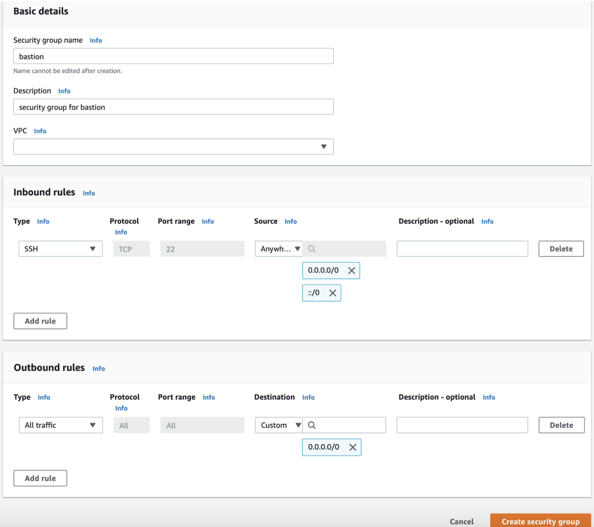
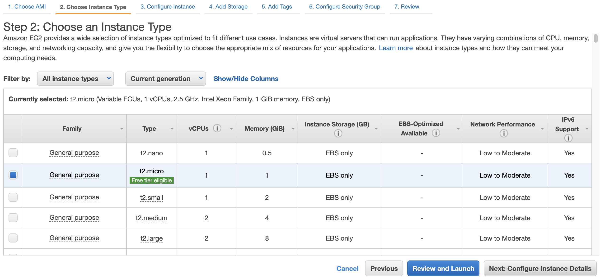
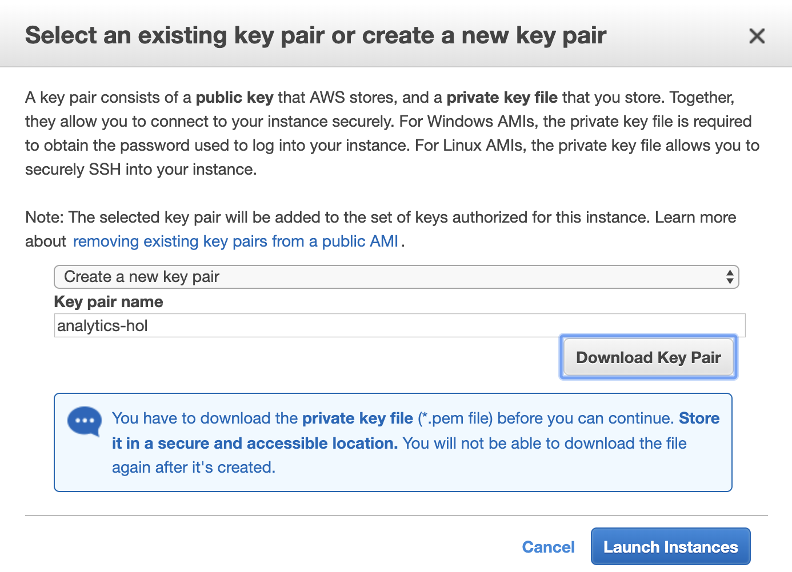
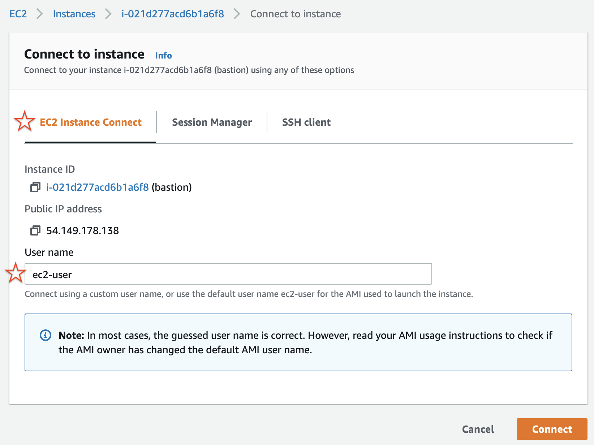

# <a name="top"></a>실습 준비 작업
실습을 시작 하기 전에 필요한 IAM User, EC2를 생성하고 및 구성합니다.

## Table of Contents
* [IAM User 생성](#iam-user)
* [Security Groups 생성](#security-group)
* [EC2 생성](#ec2-launch)
* [EC2 설정](#ec2-user-configuration)

## <a name="iam-user"></a>IAM User 생성
실습 하는 동안 사용할 IAM User를 생성합니다.

1. AWS Management Console에 로그인 한 뒤 IAM 서비스에 접속합니다.
2. 왼쪽 메뉴에서 Users를 선택합니다.
3. Add user 버튼을 클릭하여 사용자 추가 페이지로 들어갑니다.
4. User name에 `<사용자 이름>` 을 입력하고, Access type에 Programmatic access와
AWS Management Console access 둘 모두를 선택합니다. Console password에 `<패스워드>` 를 입력하고,
마지막 Require password reset의 체크는 해제합니다.
 
5. **\[Next: Permissions\]** 버튼을 클릭하고 Attach existing policies directly를 선택한 뒤 AdministratorAccess 권한을 추가해줍니다.
 
6. **\[Next: Review\]** 버튼을 클릭하고 정보를 확인한 뒤 Create user 버튼을 클릭하여 사용자 생성을 완료합니다.
7. Download.csv 버튼을 클릭하여 생성한 사용자의 정보를 다운 받습니다. EC2 설정에 꼭 필요한 파일이므로 기억하기 쉬운 위치에 저장합니다.
 
\[[Top](#top)\]

## <a name="security-group"></a>Security Groups 생성
### bastion host로 사용할 EC2 인스턴스를 위한 Security Groups 생성
실습용 EC2 인스턴에서 사용할 security group을 생성하고 구성합니다.

1. AWS Management Console에서 EC2 서비스에 접속합니다.
2. **NETWORK & SECURITY** 메뉴에서 **Security Groups** 항목을 선택합니다.
3. **\[Create Security Group\]** 을 클릭합니다.
4. Create Security Group 화면에서 Security Group에 필요한 정보를 입력한 후, 새로운 security group을  **\[Create\]** 합니다.
    + Security group name : `bastion`
    + Description : `security group for bastion`
 
    Security group rules의 **Inbound** 에 아래 내용을 입력합니다.
    + Type : SSH
    + Protocol : TCP
    + Port Range : 22
    + Source : `0.0.0.0/0`

    

\[[Top](#top)\]

### Elasicsearch Service에서 사용할 Security Groups 생성
Elasticsearch Service을 위한 security group을 생성하고 구성합니다.
1. AWS Management Console에서 EC2 서비스에 접속합니다.
2. **NETWORK & SECURITY** 메뉴에서 **Security Groups** 항목을 선택합니다.
3. **\[Create Security Group\]** 을 클릭합니다.
4. Create Security Group 화면에서 Security Group에 필요한 정보를 입력한 후, 새로운 security group을  **\[Create\]** 합니다.
    + Security group name : `use-es-cluster-sg`
    + Description : `security group for an es client`

    Security group rules의 **Inbound** 은 아무것도 입력하지 않습니다.
    
    
5. 다시 **\[Create Security Group\]** 클릭해서 Create Security Group 화면으로 이동합니다.
Security Group에 필요한 정보를 입력한 후, 새로운 security group을 **\[Create\]** 합니다.
    + Security group name : `es-cluster-sg`
    + Description : `security group for an es cluster`
 
    Security group rules의 **Inbound** 에 아래 내용을 입력합니다.
    + Type : All TCP
    + Protocol : TCP
    + Port Range : 0-65535
    + Source : `use-es-cluster-sg` 의 security group id ex) sg-038b632ef1825cb7f

     

\[[Top](#top)\]

## <a name="ec2-launch"></a>EC2 생성
실습에 필요한 데이터를 실시간으로 발생시킬 EC2 인스턴스를 생성합니다.
1. AWS Management Console에서 EC2 서비스에 접속합니다.
2. 우측 상단에서 Region은 US West (Oregon)를 선택합니다. 
3. 좌측 **INSTANCES** 메뉴에서 **Instances** 를 선택한 후, **\[Launch Instance\]** 를 클릭 해서 새로운 인스턴스 생성을 시작합니다.
 
4. Step 1: Choose an Amazon Machine Image (AMI) 화면에서 **Amazon Linux AMI 2018.03.0 (HVM), SSD Volume Type** 을 선택합니다.
 
5. Step 2 : Choose an Instance Type 화면에서 인스턴스 타입은 t2.micro를 선택합니다. **\[Next: Configure Instance Details\]** 을 클릭합니다.
 
6. Step 3: Configure Instance Details 화면에서 **Auto-assign Public IP** 를 **Enable** 선택하고, **\[Next: Add Storage\]** 을 클릭합니다.
 
7. Step 4: Add Storage 화면에서 기본값을 그대로 두고 **\[Next: Add Tags\]** 를 클릭합니다.
8. Step 5: Add Tags 화면에서 **\[Next: Configure Security Group\]** 을 클릭합니다.
9. Step 6: Configure Security Group 화면에서 Assign a security group 에서 Select an **existing** security group를 선택하고,
Security Group 중에서 Name이 `bastion`과 `use-es-cluster-sg` 를 선택 한 후 **\[Review and Launch\]** 를 클릭합니다.
 
10. Step 7: Review Instance Launch 화면에서 **\[Launch\]** 를 클릭합니다.
11. EC2 Instance에 접속하기 위한 Key pair를 생성합니다. 
Create a new key pair를 선택하고 Key pair name은 `analytics-hol` 을 입력한 후 Download Key Pair를 클릭합니다.
Key Pair를 PC의 임의 위치에 저장한 후 **\[Launch Instances\]** 를 클릭합니다. (인스턴스 기동에 몇 분이 소요될 수 있습니다.)
 
12. (MacOS 사용자) 다운로드 받은 Key Pair 파일의 File Permission을 400으로 변경합니다.
    ```shell script
    $ chmod 400 ./analytics-hol.pem 
    $ ls -lat analytics-hol.pem 
    -r--------  1 ******  ******  1692 Jun 25 11:49 analytics-hol.pem
    ```
    Windows OS 사용자의 경우, [PuTTY를 사용하여 Windows에서 Linux 인스턴스에 연결](https://docs.aws.amazon.com/AWSEC2/latest/UserGuide/putty.html)
    를 참고하십시요.

\[[Top](#top)\]

## <a name="ec2-user-configuration"></a>EC2 설정
생성한 EC2 인스턴스가 다른 AWS 리소스에 접근 및 제어할 수 있도록 다음과 같이 구성합니다.
1. 생성한 인스턴스의 Public IP로 SSH 접속을 합니다.
    ```shell script
    ssh -i "<Key pair name>" ec2-user@<Public IP>
    ```
  또는, [https://console.aws.amazon.com/ec2/](https://console.aws.amazon.com/ec2/)에서 Amazon EC2 콘솔을 엽니다.<br/>
탐색 창에서 방금 생성한 **인스턴스**를 선택하고, **Connect**를 클릭합니다.<br/>
 
다음과 같은 화면이 뜨면, **Connect** 를 눌러 인스턴스에 접속합니다.
 

2. ssh로 접속한 EC2 인스턴스에서 다음 작업을 순서대로 수행 합니다.

    (1) 소소 코드를 다운로드 받는다. 
    ```shell script
    wget 'https://github.com/ksmin23/aws-analytics-immersion-day/archive/master.zip'
    ```
    (2) 다운로드 받은 소스 코드의 압축을 해제한다.
    ```shell script
    unzip -u main.zip
    ```
    (3) 실습 환경 설정 스크립트에 실행 권한을 부여한다.
    ```shell script
    chmod +x ./aws-analytics-immersion-day-main/set-up-hands-on-lab.sh
    ```
    (4) 실습 환경 설정 스크립트를 실행한다.
    ```shell script
    ./aws-analytics-immersion-day-main/set-up-hands-on-lab.sh
    ```
    (5) 실습 환경 설정 스크립트 실행 후, 실습에 필요한 파일들이 정상적으로 생성되었는지 확인한다. 
    예를 들어 아래와 같이 소스 코드와 필요한 파일들이 존재하는지 확인하다.
    
    

3. AWS의 다른 리소스 접근을 위해 AWS Configure를 진행합니다. 이때 앞서 생성한 IAM User 데이터를 활용합니다.
이전에 다운로드 받은 .csv 파일을 열어 `Access key ID`와 `Secret access key`를 확인하고 입력합니다.
    ```shell script
    $ aws configure
    AWS Access Key ID [None]: <Access key ID>
    AWS Secret Access Key [None]: <Secret access key>
    Default region name [None]: us-west-2
    Default output format [None]: 
    ```
4. 설정이 완료 되었다면 다음과 같이 입력하신 정보가 마스킹 되어 보이게 됩니다.
    ```shell script
    $ aws configure
    AWS Access Key ID [****************EETA]:
    AWS Secret Access Key [****************CixY]:
    Default region name [None]: us-west-2
    Default output format [None]: 
    ```

\[[Top](#top)\]
